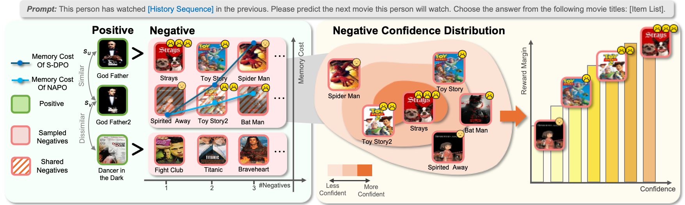

<div align=center>
<!-- <h1>Avatar: Agent-based Virtual Approach to Large Scale Recommendation Simulation</h1> -->

<h1>On Negative-aware Preference Optimization for
Recommendation</h1>




In recommendation systems, negative samples — often abundant
but underutilized — hold significant potential for improving model
performance. In this paper, we propose Negative-Aware Prefer-
ence Optimization for Recommendation (NAPO), which addresses
the challenge of effectively utilizing the abundant negative sig-
nals. NAPO extends existing approaches by incorporating multiple
negative samples, enriching the training signal and facilitating
better ranking information. To further enhance negative sample
utilization, we introduce a novel strategy for sharing unobserved
samples across similar users, which expands the negative sample
space without increasing computational overhead. Additionally, we
propose a dynamic, personalized reward margin that adjusts based
on individual user preferences, enabling more effective exploitation
of reliable negatives. Experimental evaluations demonstrate that
NAPO significantly outperforms existing methods, highlighting
the benefits of increasing both the quantity and quality of negative
samples in recommendation tasks.

</div>

<p id="Catalogue"></p>  

## 📋 Catalogue 

- [Catalogue](#Catalogue)
- [Preparations](#Preparations)
- [Quick Start](#Quick-Start)

<p id="Preparations"></p>  

## ⚙️ Preparations

### Step 1. Install requirements.txt
Set up a virtualenv and install the [pytorch](https://pytorch.org/get-started/previous-versions/) manually. After that, install all the dependencies listed in the `requirements.txt` file by running the following command:

```bash
pip install -r requirements.txt
```
Our experiments have been tested on **Python 3.9.7 with PyTorch 2.2.2+cu117**.


<p id="Quick-Start"></p> 

## ⌛️ Quick Start

We provide a sample data of **LastFM** in ./data folder. Further processing can refer to data_interface.py.

By running the following command, you will start run **Supervised Fine-Tuning** on language model based recommenders.
```bash
bash sft.sh
```

By running the following command, you will start run **Direct Preference Optimization** on language model based recommenders.
```bash
bash dpo.sh
```

By running the following command, you will start run **Softmax Direct Preference Optimization** on language model based recommenders.
```bash
bash softmax_dpo.sh
```

By running the following command, you will start run **Inference** to get the performance metrics.
```bash
bash inference.sh
```
